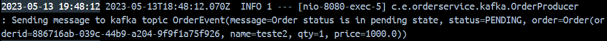
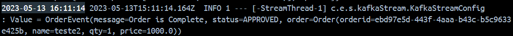
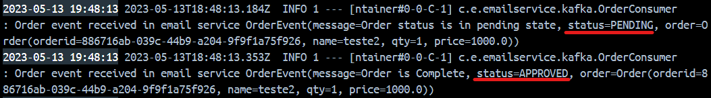
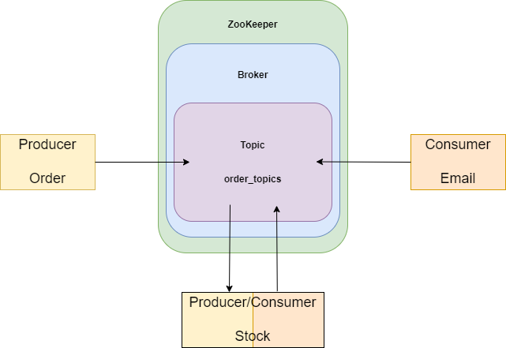

# springboot-kafka-microservices

# Description

This project serves as an illustration of leveraging Kafka, Kafka Streams, and Spring Boot within a microservice's
architecture. Additionally, Docker is employed to simplify the setup and deployment of the microservices

# How to use

To utilize the services, Docker must be installed on your machine. Once installed, navigate to the root folder of the
project and execute the following command:

```bash
docker compose up -d
```

This command will initiate the Kafka, ZooKeeper, Order, Email, and Stock services. Afterwards, simply send a POST
request to the Order service, using the example below:

```bash
curl --location 'localhost:8080/api/v1/orders' \
--header 'Content-Type: application/json' \
--data '{
    "name":"teste",
    "qty":"1",
    "price":1000
}'
```

on order-service logs you will see the following message, where the order is created:


on stock-service logs you will see the following message, where the order is approved:


and on email-service logs you will see the following message, where you can see the change of the order status:


# Architecture



# Author

- [Joao Realinho](https://www.linkedin.com/in/jo%C3%A3o-realinho-490095171/)